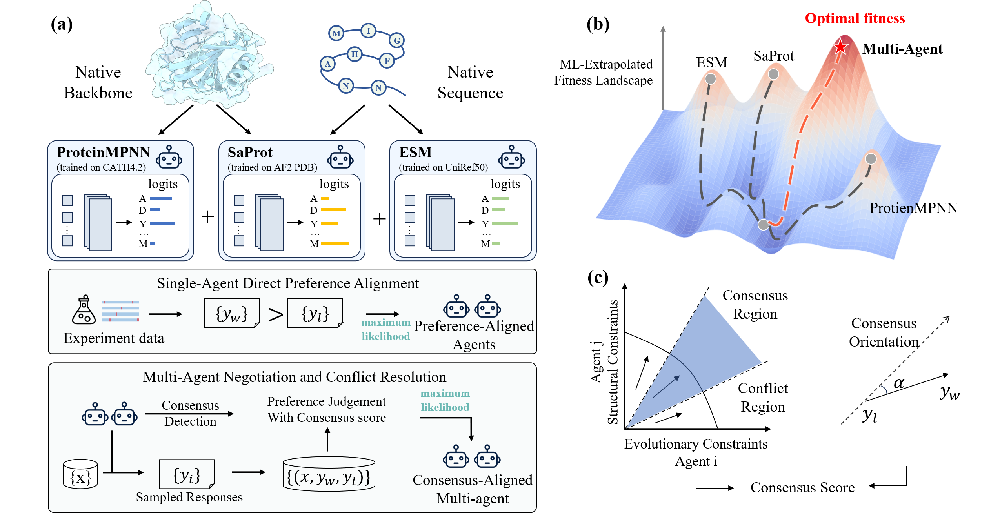

# MAProt
This repository contains the code for the MAProt, a multi-agent protein design framework. This project aims to leverage advanced pretrained models and multi-agent techniques to facilitate the design and optimization of proteins.

In the following sections, you'll find detailed instructions on how to set up the environment, install dependencies, and utilize the framework for your protein design tasks.



## Environment Installation

Open your terminal or command prompt. Create a new conda environment:
```
conda create --name MAProt python=3.8
conda activate MAProt
```
Please install ESMFold by following the instructions on the [ESMFold](https://github.com/facebookresearch/esm) official website.

### Other Dependencies
Run the following commands to install the remaining dependencies:
```
# Install OpenFold and its dependencies
pip install 'dllogger @ git+https://github.com/NVIDIA/dllogger.git'
pip install 'openfold @ git+https://github.com/aqlaboratory/openfold.git@4b41059694619831a7db195b7e0988fc4ff3a307'

# Install additional Python packages
pip install pandas==1.1.5
pip install scikit-learn==1.3.2
pip install tqdm==4.66.1
pip install biotite==0.39.0

pip install pyrosetta-installer
python -c 'import pyrosetta_installer; pyrosetta_installer.install_pyrosetta()'

pip install transformers
```
[SaProt](https://github.com/westlake-repl/SaProt/tree/main) provide a function to convert a protein structure into a structure-aware sequence. The function calls the 
[foldseek](https://github.com/steineggerlab/foldseek) 
binary file to encode the structure. You can download the binary file from [here](https://drive.google.com/file/d/1B_9t3n_nlj8Y3Kpc_mMjtMdY0OPYa7Re/view?usp=sharing) and place it in the `bin` folder

### pretrained weights
You can download the SaProt weights from [SaProt_35M_AF2](https://huggingface.co/westlake-repl/SaProt_35M_AF2) and [SaProt_650M_PDB](https://huggingface.co/westlake-repl/SaProt_650M_PDB) and place it in the `config\saprot_weights\`.

You can download the evaluator model weights for predicting DDG and delta affinity from [xx](xx) place it in the `config\DRKES_oracle_ckpt\` and `config\affinity_model\`.


# Reproducing Results
By running the following command, you can reproduce the results from the paper for the three datasets: Megascale, GFP, and AffinityDesign:

```
bash reproduce_results.sh
```
In the A800 environment, training and testing the Megascale dataset will take approximately 60 hours, while the GFP dataset requires about 3 hours, and the AffinityDesign dataset takes around 20 hours. Please ensure you allocate sufficient time for each training session to achieve the desired results.

This will execute the necessary scripts and configurations to generate the results as outlined in the study. Make sure to have your environment properly set up before running this command.